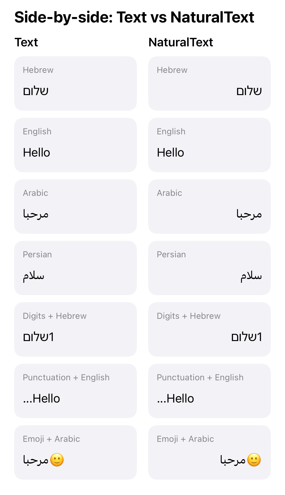

# NaturalText

NaturalText is a tiny SwiftUI package that aligns text based on the content instead of the device locale.



**Problem**

SwiftUI aligns `Text` using the device locale, not the actual content. An RTL string on an LTR-locale device aligns left instead of right. UIKit has `NSTextAlignment.natural`, but SwiftUI has no equivalent. This gap shows up in real apps.

Even on iOS 26, the new content-based writing direction APIs only affect paragraph direction inside `Text`, `TextEditor`, and `TextField`. The view-level frame alignment still follows device locale, so you still need a content-based alignment tool.

**Installation**

Swift Package Manager

1. In Xcode, go to `File > Add Package Dependencies...` and paste the repository URL.
2. Or add it in `Package.swift`:

```swift
dependencies: [
    .package(url: "https://github.com/hershalle/SwiftUI-NaturalText", from: "1.0.0")
]
```

**Usage**

Basic

```swift
NaturalText("שלום")
```

With external modifiers

```swift
NaturalText("שלום")
    .font(.title)
    .bold()
```

With `Text`-specific modifiers

```swift
NaturalText("שלום") { $0.kerning(2).bold() }
```

Using the modifier directly

```swift
Text("שלום").naturalAlignment(for: "שלום")
```

Mixed content list

```swift
VStack(alignment: .leading, spacing: 8) {
    NaturalText("שלום")
    NaturalText("Hello")
    NaturalText("مرحبا")
}
```

Side-by-side comparison

```swift
HStack(alignment: .top, spacing: 24) {
    VStack(alignment: .leading, spacing: 8) {
        Text("שלום")
        Text("Hello")
        Text("مرحبا")
    }

    VStack(alignment: .leading, spacing: 8) {
        NaturalText("שלום")
        NaturalText("Hello")
        NaturalText("مرحبا")
    }
}
```

**How It Works**

NaturalText scans the string for the first strong directional character. It skips digits, punctuation, symbols, and whitespace, then checks whether the first letter falls in known RTL Unicode scalar ranges. This approach is deterministic, fast, has no dependencies, and handles edge cases like strings starting with digits or punctuation. It avoids `NLLanguageRecognizer`, which is statistical, heavier, and unreliable for short strings.

**Demo App**

Open `Demo/NaturalTextDemo.xcodeproj` to run the SwiftUI demo that compares `Text` with `NaturalText` and showcases mixed-language alignment.

**Supported RTL Scripts**

Hebrew, Arabic, Persian, Urdu, Syriac, Thaana (Dhivehi), NKo, Samaritan, Mandaic, Adlam.

**iOS 26 Note**

iOS 26 added content-based writing direction for `Text`, `TextEditor`, and `TextField`, but the view-level frame alignment still follows the device locale. NaturalText remains necessary when you want the alignment to follow the actual content.

**License**

MIT
